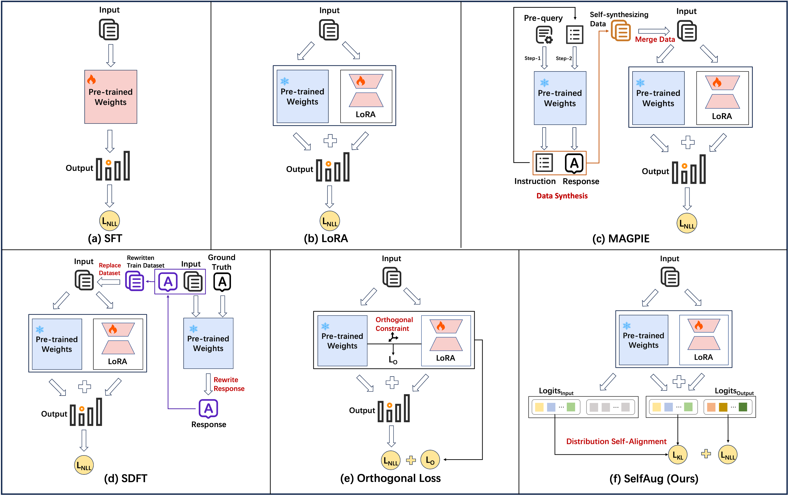

# SelfAug: Mitigating Catastrophic Forgetting in Retrieval-Augmented Generation via Distribution Self-Alignment

[](https://ustc-starteam.github.io/SelfAug/)
[](https://arxiv.org/abs/2509.03934)
[](https://arxiv.org/abs/2509.03934)
[](https://www.python.org/)

Official code for **"SelfAug: Mitigating Catastrophic Forgetting in Retrieval-Augmented Generation via Distribution Self-Alignment"**.

SelfAug mitigates catastrophic forgetting during RAG fine-tuning by aligning input-sequence logits with the original model distribution. It preserves general capability while learning downstream RAG responses, without replay data or expensive response-generation pipelines.

## 1. Paper

Yuqing Huang, Rongyang Zhang, Qimeng Wang, Chengqiang Lu, Yan Gao, Yi Wu, Yao Hu, Xuyang Zhi, Guiquan Liu, Xin Li, Hao Wang, and Enhong Chen. **SelfAug: Mitigating Catastrophic Forgetting in Retrieval-Augmented Generation via Distribution Self-Alignment.** Findings of EMNLP 2025, 2025.

[Paper](https://arxiv.org/abs/2509.03934) / [PDF](https://arxiv.org/pdf/2509.03934) / [Project Page](https://ustc-starteam.github.io/SelfAug/) / [Code](https://github.com/USTC-StarTeam/SelfAug) / [Citation](#citation)

The paper connects distribution shift with catastrophic forgetting in RAG fine-tuning. SelfAug adds a KL-divergence alignment term over input sequence logits so task learning and original-distribution preservation can be optimized together.

## 2. Highlights

- Preserves the original model distribution during RAG fine-tuning.
- Requires no extra replay data and no response-generation validation loop.
- Adds a self-distribution alignment loss alongside the downstream negative log-likelihood loss.
- Provides focused Qwen2/LoRA integration files for quick experimentation.

## 3. Method At A Glance



SelfAug combines task learning with input-logit distribution alignment. The KL term encourages the fine-tuned model to remain close to the base model on the input sequence while still learning the target response.

## 4. Repository Structure

```text
.
|-- Code/
|   |-- update_module.py      # Copy patched files to package locations
|   |-- modeling_qwen2.py     # Qwen2 modeling file to replace in transformers
|   `-- layer.py              # LoRA layer file to replace in peft
|-- Figures/                  # Original method figure
`-- docs/                     # Project page and README assets
```

## 5. Installation

Use an environment compatible with your `transformers`, `peft`, and Qwen2 fine-tuning stack. Back up the target package files before replacing them.

## 6. Data / Models

SelfAug is applied during LoRA fine-tuning. Prepare the downstream RAG fine-tuning data and the base Qwen2-compatible model according to your existing training pipeline.

## 7. Quick Start

Ensure `modeling_qwen2.py` and `layer.py` are present under `Code/`, then run:

```bash
cd Code
python update_module.py
```

After patching the local packages, proceed with LoRA fine-tuning using the normal `transformers` and `peft` workflow.

## 8. Reproducing Results / Evaluation

Use the patched model and LoRA layer in your fine-tuning script, with the SelfAug loss balancing downstream negative log-likelihood and input-logit KL divergence. Compare downstream RAG task metrics and general capability retention.

## 9. Configuration Notes

The main experimental control is the weight between task loss and self-distribution alignment loss. Keep the package versions and patched file paths fixed when reproducing reported results.

## 10. Experimental Highlights

SelfAug is designed to improve the balance between RAG specialization and general knowledge retention. The paper reports that preserving input-sequence distribution helps reduce catastrophic forgetting across fine-tuning scenarios.

## 11. Notes For Maintainers

- Keep patched package files synchronized with the target `transformers` and `peft` versions.
- Store new README/project-page figures under `docs/assets/`.
- Add ACL Anthology, slides, poster, or video links when official presentation materials become public.

<a id="citation"></a>

## 12. Citation

```bibtex
@misc{huang2025selfaug,
  title = {SelfAug: Mitigating Catastrophic Forgetting in Retrieval-Augmented Generation via Distribution Self-Alignment},
  author = {Huang, Yuqing and Zhang, Rongyang and Wang, Qimeng and Lu, Chengqiang and Gao, Yan and Wu, Yi and Hu, Yao and Zhi, Xuyang and Liu, Guiquan and Li, Xin and Wang, Hao and Chen, Enhong},
  year = {2025},
  eprint = {2509.03934},
  archivePrefix = {arXiv},
  primaryClass = {cs.CL},
  url = {https://arxiv.org/abs/2509.03934}
}
```

## 13. Contact

For paper questions, contact Hao Wang at `wanghao3@ustc.edu.cn` or Enhong Chen at `cheneh@ustc.edu.cn`. For repository issues, please open a GitHub issue in this repository.
